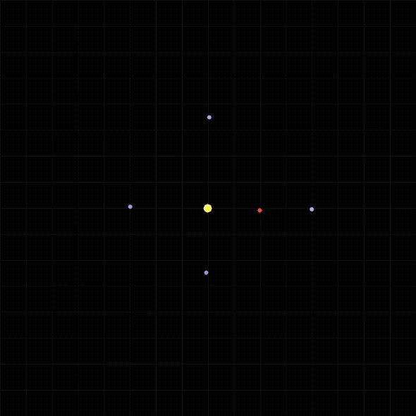

# Rocket Trajectories in the Solar System

In this lecture, we will go over a program that computes the trajectory of rockets in a solar system.


---

Please go over the code in : [main.c](./main.c)

Read about BMP image files: https://en.wikipedia.org/wiki/BMP_file_format 

Try the following:
- Modularize the code into a multifile program
- Add a Makefile
- Implement the File I/O features described bellow.

---

## Solution Repository

https://github.com/cpro-iiit/rocket_sim 


---


# 🚀 C Programming Exercises: Rocket Simulation & File I/O

These exercises build on the given rocket trajectory simulation program.
Each problem focuses on adding new functionality that requires students to use C file I/O (text and binary) effectively.

## 🧩 Part 1: Input Extensions
### Exercise 1.1 — Load Body Parameters from a File

Goal: Replace the hard-coded initialization of celestial bodies with data read from a text file.

File format (bodies.txt):

```
# x  y   vx  vy   mass
0.0 0.0  0.0 0.0  100.0
2.0 0.0  0.0 0.8  5.0
-2.0 0.0  0.0 -0.8  5.0
...
```


Tasks:

- Write a function int `load_bodies(const char *filename, Body *bodies, int max_bodies);`

- Open the file and read lines into the bodies array.

- Ignore lines starting with `#`.

- Return the number of bodies successfully loaded.

- Modify main() to call this function instead of init_bodies().

- Handle file-not-found errors gracefully.

### Exercise 1.2 — Initialize Rockets from a File

Goal: Allow flexible rocket starting conditions.

File format (rockets.txt):
```
# x  y   vx   vy
-8.0 -6.0 0.000005 0.000004
-6.0  5.0 0.000005 -0.000004
```


Tasks:

- Implement `int load_rockets(const char *filename, Rocket *rockets, int max_rockets);`

- Modify `init_rockets()` to use this function if a file exists; otherwise fall back to default initialization.

- Print loaded rockets to the console for verification.

## 💾 Part 2: Output Extensions
### Exercise 2.1 — Save Final Rocket Positions

Goal: Write final rocket positions and velocities to a text file after the simulation.

Tasks:

- Create a function:

`void save_rocket_data(const char *filename, Rocket *rockets, int n);`


It should write:
```
Rocket_ID   Final_X   Final_Y   Final_VX   Final_VY   Trail_Length
```

Call this function at the end of the simulation (e.g., `save_rocket_data("final_rockets.txt", rockets, N_ROCKETS);`).

### Exercise 2.2 — Save Rocket Trajectories in Binary Format

Goal: Store all positions in binary for later analysis or visualization.

Tasks:

- Implement:

`void save_rocket_trails_bin(const char *filename, Rocket *rockets, int n);`

- Store `trail_length` followed by `(x, y)` pairs for each rocket.

- Use `fwrite()` for efficient binary output.

- Add a separate program `analyze_trails.c` that: 
  - Reads this binary file.
  - Computes total trajectory length and prints summary statistics.

### Exercise 2.3 — Frame Metadata Log

Goal: Maintain a log file that records when each BMP frame was generated.

Tasks:

- Before the main loop, open `frames.log` in write mode.

- During rendering:

Append a line:

`Frame 12: Step 600, Rocket0_Pos (-1.24, 3.98)`

- Include timestamp using time.h if you want bonus points.

- Close the file at the end.

## 📈 Part 3: Analysis Extensions
### Exercise 3.1 — Trajectory Summary Statistics

Goal: Write summary information for each rocket into a CSV file.

Output format (rocket_stats.csv):
```
RocketID,TrailLength,FinalDistance,MaxDistance,AverageSpeed
0,3200,45.7,48.9,0.032
1,2500,22.1,40.2,0.028
```

Hints:

- FinalDistance = sqrt(x² + y²) at last point.

- AverageSpeed = total_distance / simulation_time.

### Exercise 3.2 — Reload and Plot Trails

Goal: Read the stored binary or text trajectory file and re-render them into a new BMP image (without re-running simulation).

Tasks:

- Implement a standalone program `plot_trails.c`.

- It should:

  - Read rocket trail data from file.

  - Use the same `render()` and `write_bmp()` functions to visualize the loaded trails.

## 🧠 Challenge Exercises (Advanced)
### Exercise 4.1 — Combine File I/O and User Interaction

Let users choose between:

Running a new simulation (N)

Loading and re-plotting saved data (L)

Use scanf() to read the user choice and perform appropriate file I/O.

### Exercise 4.2 — Save Simulation Parameters

Write a function save_metadata() to record:
```
Width, Height, Steps, DT, G, N_Bodies, N_Rockets
```

and other constants into a metadata.txt file.
Students can then write a corresponding load_metadata() function that rebuilds the same configuration later.

### Exercise 4.3 — Implement a Configurable Save Interval

Currently, frames are saved every frame_interval.
Modify the code so that the interval can be read from a config file:

```
dt=0.01
frames=200
save_interval=50
```

---


# File I/O: Revision


---

## 🗂️ 1. Introduction to File I/O in C

C provides a set of standard library functions for reading and writing data to files.

These are declared in:
```c
#include <stdio.h>
```

There are two main types of file I/O:

1. **Text (Formatted) I/O** – `fprintf`, `fscanf`, `fgets`, etc.  
2. **Binary I/O** – `fread`, `fwrite`.

---

## 🧱 2. The FILE Pointer

Every file in C is represented by a `FILE*` structure.

```c
FILE *fp;
```

- It acts as a handle for accessing the file.
- You must **open** a file before reading or writing.

---

## 📖 3. Opening and Closing Files

### Syntax:
```c
FILE *fopen(const char *filename, const char *mode);
int fclose(FILE *stream);
```

### Common modes:
| Mode | Meaning | Creates new file? |
|------|----------|-------------------|
| `"r"` | Read | No |
| `"w"` | Write (truncate existing) | Yes |
| `"a"` | Append | Yes |
| `"r+"` | Read + Write | No |
| `"w+"` | Read + Write (truncate) | Yes |
| `"a+"` | Read + Append | Yes |

### Example:
```c
FILE *fp = fopen("data.txt", "r");
if (fp == NULL) {
    perror("Error opening file");
    return 1;
}
fclose(fp);
```

### Return value:
- `fopen` → returns `NULL` if it fails.
- `fclose` → returns `0` on success, `EOF` on error.

---

## ✏️ 4. Formatted I/O (fprintf / fscanf)

### Writing formatted data:
```c
fprintf(FILE *stream, const char *format, ...);
```

### Reading formatted data:
```c
fscanf(FILE *stream, const char *format, ...);
```

### Example:
```c
FILE *fp = fopen("students.txt", "w");
fprintf(fp, "%s %d\n", "Alice", 90);
fprintf(fp, "%s %d\n", "Bob", 85);
fclose(fp);
```

```c
FILE *fp = fopen("students.txt", "r");
char name[20];
int score;
while (fscanf(fp, "%s %d", name, &score) == 2) {
    printf("%s scored %d\n", name, score);
}
fclose(fp);
```

**Return value:**  
`fprintf` → number of characters written  
`fscanf` → number of successful conversions, or `EOF` on failure

---

## 📜 5. Line-based I/O: fgets and fputs

Used for reading or writing **one line at a time**.

```c
char *fgets(char *str, int n, FILE *stream);
int fputs(const char *str, FILE *stream);
```

### Example:
```c
FILE *fp = fopen("data.txt", "r");
char line[100];
while (fgets(line, sizeof(line), fp) != NULL) {
    printf("%s", line);
}
fclose(fp);
```

---

## ⚙️ 6. Character-based I/O: fgetc and fputc

Used to read or write **one character** at a time.

```c
int fgetc(FILE *stream);
int fputc(int ch, FILE *stream);
```

### Example:
```c
FILE *fp = fopen("copy.txt", "w");
FILE *src = fopen("source.txt", "r");
int ch;
while ((ch = fgetc(src)) != EOF)
    fputc(ch, fp);
fclose(src);
fclose(fp);
```

**Return value:**  
- `fgetc` → next character or `EOF`  
- `fputc` → character written or `EOF` on error  

---

## 💾 7. Binary File I/O

Binary files store data **as raw bytes** — faster and smaller, but not human-readable.

### Functions:
```c
size_t fread(void *ptr, size_t size, size_t nmemb, FILE *stream);
size_t fwrite(const void *ptr, size_t size, size_t nmemb, FILE *stream);
```

### Example:
```c
typedef struct {
    char name[20];
    int age;
} Person;

Person p1 = {"Alice", 25};

FILE *fp = fopen("people.dat", "wb");
fwrite(&p1, sizeof(Person), 1, fp);
fclose(fp);

// Reading
Person p2;
fp = fopen("people.dat", "rb");
fread(&p2, sizeof(Person), 1, fp);
printf("%s %d\n", p2.name, p2.age);
fclose(fp);
```

**Return value:**  
- Number of elements successfully read/written.

---

## 🧭 8. File Positioning — fseek, ftell, rewind

Used to **navigate inside a file**.

```c
int fseek(FILE *stream, long offset, int whence);
long ftell(FILE *stream);
void rewind(FILE *stream);
```

### `whence` values:
| Value | Meaning |
|--------|----------|
| `SEEK_SET` | Beginning of file |
| `SEEK_CUR` | Current position |
| `SEEK_END` | End of file |

### Example:
```c
FILE *fp = fopen("data.txt", "r");
fseek(fp, 0, SEEK_END);
long size = ftell(fp);
printf("File size: %ld bytes\n", size);
rewind(fp);
fclose(fp);
```

---

## 🔢 9. sprintf and sscanf (String Formatting)

These are like `printf` and `scanf`, but work **on strings instead of files or stdin**.

### sprintf
Formats data into a string.

```c
int sprintf(char *str, const char *format, ...);
```

### sscanf
Reads data from a string.

```c
int sscanf(const char *str, const char *format, ...);
```

### Example:
```c
char buffer[50];
int a = 10, b = 20;
sprintf(buffer, "Sum = %d", a + b);
printf("%s\n", buffer);

char input[] = "42 3.14 Hello";
int x;
float y;
char word[10];
sscanf(input, "%d %f %s", &x, &y, word);
printf("%d %.2f %s\n", x, y, word);
```

**Return value:**  
- `sprintf` → number of characters written  
- `sscanf` → number of successful conversions  

---

## ⚠️ 10. Error Handling and EOF

### Checking for errors:
```c
int ferror(FILE *stream);
int feof(FILE *stream);
clearerr(FILE *stream);
```

Example:
```c
FILE *fp = fopen("input.txt", "r");
if (fp == NULL) {
    perror("Failed to open file");
    return 1;
}

int ch;
while ((ch = fgetc(fp)) != EOF) {
    putchar(ch);
}

if (ferror(fp))
    printf("Error reading file\n");
else if (feof(fp))
    printf("End of file reached\n");

fclose(fp);
```

---

## 💡 11. Summary

| Function | Purpose | Return Value |
|-----------|----------|---------------|
| `fopen` | Open a file | `FILE*` / `NULL` |
| `fclose` | Close file | `0` / `EOF` |
| `fprintf` / `fscanf` | Formatted text I/O | # of items written/read |
| `fread` / `fwrite` | Binary I/O | # of items read/written |
| `fseek` | Move file pointer | `0` / nonzero |
| `ftell` | Get current position | position / `-1L` |
| `sprintf` / `sscanf` | String I/O | # of chars/items written/read |

---

## 🧩 12. Practice Exercises

1. Write a program to copy a text file to another using character-by-character I/O.  
2. Store a list of students (structs) into a binary file and read it back.  
3. Count the number of words in a text file using line-by-line reading.  
4. Implement a file seek operation that prints the last N bytes of a file.  
5. Use `sprintf` and `sscanf` to convert between formatted text and numbers.

---

## 🎯 13. Key Takeaways

- Always **check return values** of file operations.
- Close all files using `fclose`.
- For performance, use **binary I/O** when exact structure layout matters.
- `fseek`, `ftell`, and `rewind` give you random access to file data.
- `sprintf` and `sscanf` allow you to process formatted data in memory.


---
