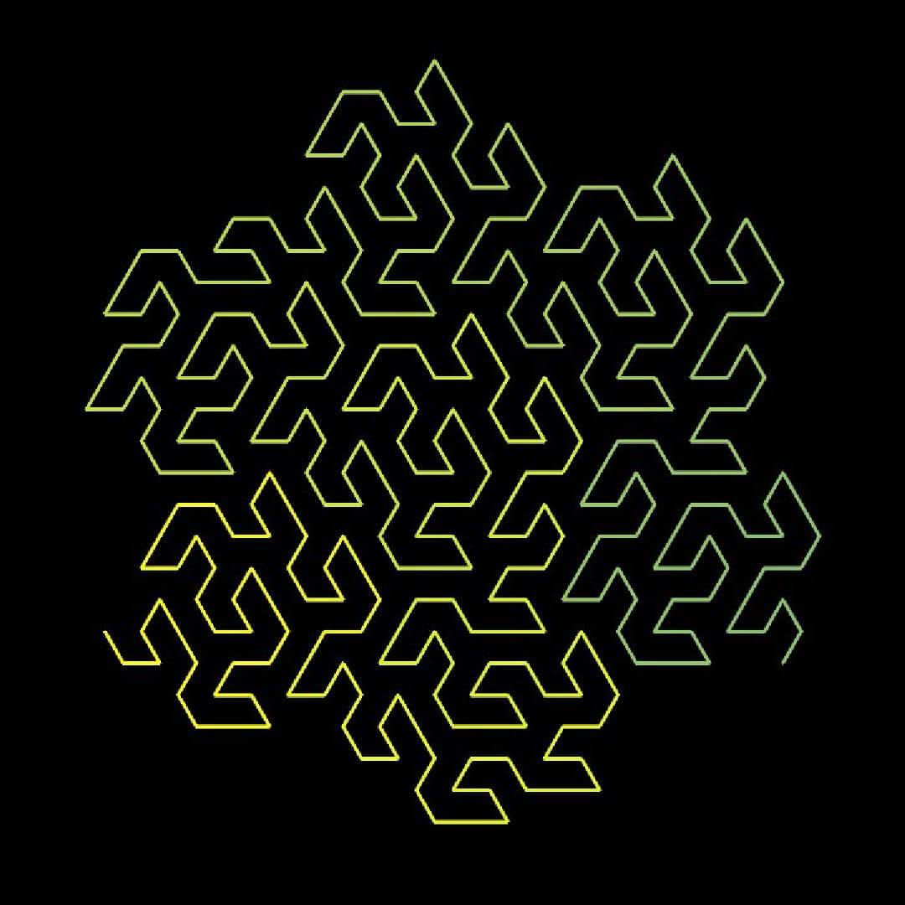

# Space Filling Curves

A C program that generates 2D Hilbert space-filling curves and outputs them as BMP images.

**https://www.youtube.com/watch?v=3s7h2MHQtxc (Highly Reccomended)**.  
  Learn how programing, discrete maths, real analsis comes together to define Space filling curves.  



Repository: https://github.com/cpro-iiit/space-filling-curve/


### Hilbert Curves

Learn about Hilbert Space filling curves here: 
- **https://www.youtube.com/watch?v=3s7h2MHQtxc (Highly Reccomended)**.  
  Learn how programing, discrete maths, real analsis comes together to define Space filling curves.  
- https://www.youtube.com/watch?v=x-DgL49CFlM
- https://www.youtube.com/watch?v=v99dsVBE4xQ

Read: 
- https://arxiv.org/abs/2501.04705

### Drawing Hilbert Curves

Go through bellow:
- https://towardsdatascience.com/the-beauty-of-space-filling-curves-understanding-the-hilbert-curve/
- https://www.youtube.com/watch?v=dSK-MW-zuAc

### Uses of Hilbert Curves

- Generative AI: https://arxiv.org/html/2509.26538v1#S3
- Google Maps: https://blog.christianperone.com/2015/08/googles-s2-geometry-on-the-sphere-cells-and-hilbert-curve/?a=2
- https://www.youtube.com/watch?v=OcUKFIjhKu0
- GPUs:
    - https://developer.nvidia.com/blog/thinking-parallel-part-iii-tree-construction-gpu/
    - https://ieeexplore.ieee.org/document/7836590
    


## Student Exercises

These exercises are designed to help you understand space-filling curves, image processing, and C programming. They range from beginner to advanced difficulty.

### Beginner Exercises

#### Exercise 1: Color Variations (★☆☆☆☆)
**Goal**: Learn about RGB color interpolation

Modify the color gradient in `main.c` to create different visual effects:

a) Create a rainbow gradient (red → yellow → green → cyan → blue)
```c
// Hint: You'll need to vary all three RGB channels
// Consider using different formulas for different segments of t
```

b) Create a grayscale gradient (black → white)
```c
// Hint: Set r = g = b to the same value
```

c) Create a custom gradient using your favorite colors

**What you'll learn**: Color theory, interpolation, basic math in C

---

#### Exercise 2: Different Curve Orders (★☆☆☆☆)
**Goal**: Understand how curve order affects complexity

Generate Hilbert curves of orders 2, 4, 6, and 8. For each:
- Record the generation time
- Note the file size
- Observe how the curve pattern changes

**Questions to answer**:
1. How does the number of points relate to the order?
2. What pattern do you see in file sizes as order increases?
3. At what order does the curve start to "look" space-filling?

**What you'll learn**: Algorithm complexity, power-of-two relationships

---

#### Exercise 3: Add Image Size to Filename (★★☆☆☆)
**Goal**: Practice string manipulation in C

Modify `main.c` to include the image dimensions in the output filename:
- Instead of `hilbert_curve.bmp`
- Generate `hilbert_curve_512x512.bmp`

```c
// Hint: Use sprintf() to create the filename string
char filename[256];
sprintf(filename, "hilbert_curve_%dx%d.bmp", width, height);
```

**What you'll learn**: String formatting, sprintf(), dynamic naming

---

### Intermediate Exercises

#### Exercise 4: Implement Z-Order (Morton) Curve (★★★☆☆)
**Goal**: Understand other space-filling curves

Create a new file `morton.c` and `morton.h` that implements the Z-order curve (also called Morton order):

```c
void morton_d2xy(int n, int d, int *x, int *y);
```

The Z-order curve is simpler than Hilbert but doesn't preserve locality as well. The algorithm interleaves bits:
- For d = 1101₂ (binary), separate odd and even bits
- Even bits (positions 0,2,4,...) form x coordinate
- Odd bits (positions 1,3,5,...) form y coordinate

**Challenge**: Compare the visual appearance of Hilbert vs Z-order curves. Which one has better locality?

**What you'll learn**: Bit manipulation, different space-filling curves, comparative analysis

---

#### Exercise 5: Add Command-Line Arguments (★★★☆☆)
**Goal**: Learn about argc/argv and user input

Modify `main.c` to accept command-line arguments:

```bash
./hilbert_curve --order 7 --scale 6 --output my_curve.bmp
```

Requirements:
- Parse command-line arguments using `argc` and `argv`
- Provide default values if arguments aren't specified
- Add a `--help` option that explains usage
- Validate input (e.g., order must be positive, scale must be > 0)

**Hints**:
```c
#include <string.h>

int main(int argc, char *argv[]) {
    // Default values
    int order = 6;
    int scale = 8;
    char *output = "hilbert_curve.bmp";
    
    // Parse arguments
    for (int i = 1; i < argc; i++) {
        if (strcmp(argv[i], "--order") == 0) {
            // Get next argument as order
        }
        // ... more parsing
    }
}
```

**What you'll learn**: Command-line parsing, input validation, user-friendly programs

---

#### Exercise 6: Measure and Display Performance Metrics (★★★☆☆)
**Goal**: Learn about profiling and timing

Add timing code to measure how long each stage takes:

```c
#include <time.h>

clock_t start = clock();
// ... code to time ...
clock_t end = clock();
double cpu_time = ((double)(end - start)) / CLOCKS_PER_SEC;
printf("Time taken: %.3f seconds\n", cpu_time);
```

Measure and display:
- Point generation time
- Rendering time
- File writing time
- Total time
- Memory used (width × height × 3 bytes for image)

**Bonus**: Create a performance comparison table for different orders.

**What you'll learn**: Performance measurement, profiling, optimization awareness

---

#### Exercise 7: Add Line Thickness Option (★★★☆☆)
**Goal**: Enhance graphics capabilities

Modify `graphics.c` to add a `drawThickLine()` function that draws lines with variable thickness:

```c
void drawThickLine(uint8_t *img, int width, int height,
                   int x0, int y0, int x1, int y1,
                   uint8_t r, uint8_t g, uint8_t b,
                   int thickness);
```

**Hint**: Draw multiple parallel lines offset perpendicular to the main line direction.

**Challenge**: Make thickness odd to keep the line centered (thickness 1, 3, 5, ...).

**What you'll learn**: Graphics algorithms, geometry, perpendicular vectors

---

### Advanced Exercises

#### Exercise 8: 3D Hilbert Curve (★★★★☆)
**Goal**: Extend to three dimensions

Implement a 3D Hilbert curve generator. You'll need:

1. New function `d2xyz()` that converts 1D distance to 3D coordinates
2. Decision: How to visualize? Options:
   - Project to 2D using perspective
   - Export to 3D format (OBJ, STL)
   - Create animated rotation GIF

**Research needed**: 3D Hilbert curves use 8 octants instead of 4 quadrants. Look up the algorithm or derive it yourself!

**What you'll learn**: 3D geometry, recursive algorithms, data visualization

---

#### Exercise 9: Interactive Curve Explorer (★★★★☆)
**Goal**: Create a GUI application

Create an interactive program using SDL2 or similar library:

Features to implement:
- Real-time curve generation as user drags a slider
- Zoom and pan controls
- Click on a point to show its distance value
- Animation showing curve being drawn
- Switch between Hilbert, Z-order, and other curves

**What you'll learn**: GUI programming, event handling, real-time graphics

---

#### Exercise 10: Reverse Algorithm - xy2d (★★★★☆)
**Goal**: Implement the inverse function

Create a function that converts (x,y) coordinates back to distance along curve:

```c
int xy2d(int n, int x, int y);
```

This is useful for:
- Spatial database indexing
- Finding which point in the curve corresponds to a pixel
- Range queries

**Challenge**: Make it efficient (O(log n) time, not brute force search).

**Hint**: Reverse the logic of d2xy - process from coarse to fine levels.

**What you'll learn**: Algorithm reversal, spatial indexing, inverse problems

---

#### Exercise 11: Curve Comparison Tool (★★★★☆)
**Goal**: Analyze space-filling curve properties

Create a program that generates multiple curves and compares them:

Metrics to calculate:
1. **Locality score**: Average distance between consecutive points
2. **Clustering**: How well nearby curve positions cluster in 2D space
3. **Jump distance**: Maximum distance between consecutive points

Curves to compare:
- Hilbert curve
- Z-order (Morton) curve
- Peano curve (if you implement it)
- Row-major scan (trivial baseline)

Output a report showing which curve has the best locality properties.

**What you'll learn**: Algorithm analysis, metrics design, comparative studies

---

#### Exercise 12: Optimized Memory Usage (★★★★★)
**Goal**: Reduce memory footprint

The current implementation stores all points in memory. For very high orders (9+), this uses significant RAM.

Implement a streaming version that:
1. Generates points on-the-fly without storing them
2. Draws each line segment immediately
3. Uses only O(1) memory instead of O(n²)

**Challenge**: You'll need to maintain state between consecutive d2xy calls or redesign the algorithm.

**What you'll learn**: Memory optimization, streaming algorithms, space-time tradeoffs

---

#### Exercise 13: Multi-threaded Rendering (★★★★★)
**Goal**: Learn parallel programming

Modify the rendering to use multiple threads:

1. Divide the curve into segments
2. Assign each segment to a different thread
3. Each thread draws its portion of the curve
4. Use mutexes/locks to prevent race conditions when writing to image buffer

**Hints**:
```c
#include <pthread.h>

typedef struct {
    uint8_t *img;
    Point *points;
    int start_idx;
    int end_idx;
    // ... other needed data
} ThreadData;

void* render_segment(void *arg) {
    ThreadData *data = (ThreadData*)arg;
    // Draw lines from data->start_idx to data->end_idx
}
```

**Challenge**: Measure speedup. Does it scale linearly with number of cores?

**What you'll learn**: Multi-threading, parallelization, synchronization, performance tuning

---

#### Exercise 14: Fractal Animation (★★★★★)
**Goal**: Create animated visualizations

Generate an animation showing the curve being drawn progressively:

1. Create multiple BMP frames showing different percentages complete
2. Use ffmpeg or similar tool to combine into video/GIF
3. Add smooth transitions between orders (morphing effect)

**Advanced**: Show the recursive subdivision process, highlighting which quadrant is being processed at each level.

**What you'll learn**: Animation principles, frame generation, video encoding

---

#### Exercise 15: Locality Benchmark Suite (★★★★★)
**Goal**: Rigorous scientific analysis

Create a comprehensive benchmark that:

1. Generates curves of varying orders (2-10)
2. Simulates cache behavior for different access patterns
3. Measures:
   - Average Euclidean distance between consecutive points
   - Standard deviation of distances
   - Hausdorff distance from ideal space-filling
   - Cache miss rate for simulated memory access

4. Outputs scientific paper-quality graphs and tables
5. Compares Hilbert, Z-order, Peano, and row-major scanning

**Deliverables**:
- CSV data files with measurements
- Python/R scripts to generate publication-quality plots
- Written report analyzing results

**What you'll learn**: Scientific computing, benchmarking methodology, data analysis, technical writing

---

### Space-Filling Curves Exercises

These exercises focus specifically on implementing and comparing different space-filling curves. Each curve has unique properties and applications.

#### Exercise 16: Peano Curve (★★★☆☆)
**Goal**: Implement the first space-filling curve ever discovered

The Peano curve (1890) predates the Hilbert curve and divides space into a 3×3 grid at each level.

**Implementation requirements**:
1. Create `peano.c` and `peano.h`
2. Implement `peano_d2xy(int n, int d, int *x, int *y)` where n must be a power of 3
3. The curve visits 9 subcells in this order: bottom-left to top-left (snake pattern)

**Algorithm overview**:
- Base case: 3×3 grid, cells numbered 0-8
- Recursive case: Each cell contains a rotated/reflected 3×3 Peano curve
- Use base-9 arithmetic instead of base-4

**Pattern for 3×3 grid**:
```
6 7 8
5 4 3
0 1 2
```

**Hints**:
- Convert distance d to base-9 representation
- Each base-9 digit determines which of 9 subcells to enter
- Rotation pattern: different for each of the 9 subcells

**Challenge questions**:
1. How does Peano's locality compare to Hilbert's?
2. Why might 3×3 subdivision be useful?
3. Calculate the fractal dimension of the Peano curve

**What you'll learn**: Base-n arithmetic, historical algorithms, alternative subdivision strategies

---

#### Exercise 17: Moore Curve (★★★☆☆)
**Goal**: Implement a closed-loop space-filling curve

The Moore curve is a variant of the Hilbert curve that forms a closed loop (starts and ends at adjacent points).

**Key differences from Hilbert**:
- Uses a 2×2 grid like Hilbert
- Forms a closed loop instead of open path
- Four copies of Hilbert curve with different orientations
- The endpoint connects back near the start

**Implementation**:
1. Create `moore.c` and `moore.h`
2. Modify the Hilbert rotation logic to create closed loop
3. Ensure the last point is adjacent to the first

**Algorithm approach**:
```
Moore curve = 4 Hilbert curves arranged in a square:
  [Hilbert↺90°] [Hilbert]
  [Hilbert↺180°] [Hilbert↺270°]
```

**Visualization challenge**: Color the curve so the closed-loop property is obvious (different color when returning to start).

**Applications**: Useful for cyclic data structures, closed-path routing

**What you'll learn**: Curve variants, closed paths, rotation transformations

---

#### Exercise 18: Sierpiński Curve (★★★★☆)
**Goal**: Implement a curve based on the Sierpiński triangle

The Sierpiński curve traverses the Sierpiński triangle fractal, visiting all points except those in removed triangles.

**Mathematical background**:
- Based on the Sierpiński triangle fractal
- Uses triangular subdivision instead of square
- More complex rotation patterns

**Implementation approach**:
1. Create `sierpinski.c` and `sierpinski.h`
2. Use triangular coordinates (barycentric coordinates)
3. Recursive subdivision into 3 sub-triangles

**Coordinate system**:
- Use (x, y) coordinates where y increases upward
- Map triangular structure to square grid for display
- Handle the gaps (removed triangles) appropriately

**Hint**: Start with an equilateral triangle subdivision:
```
    /\
   /  \
  /____\
 /\  /\
/  \/  \
```

**Challenge**: 
- Create a version that works in hexagonal coordinates
- Compare fractal dimension with Hilbert/Peano curves

**What you'll learn**: Triangular subdivision, fractal geometry, barycentric coordinates

---

#### Exercise 19: Dragon Curve (★★★☆☆)
**Goal**: Implement the Heighway dragon fractal

The Dragon curve is created by repeatedly folding a strip of paper and unfolding it at right angles.

**Algorithm**:
1. Start with a line segment
2. At each iteration, replace each segment with two segments at 90° angles
3. The fold pattern: R, RLR, RRLRLLR, RRLRLLRRLRLRLLR, ...

**Implementation**:
1. Create `dragon.c` and `dragon.h`
2. Generate the fold sequence (can use bit manipulation)
3. Draw the curve by following fold instructions

**Fold sequence generation**:
```c
// For position i in the sequence:
// Count trailing zeros in i
// If that count is even: R (right turn)
// If that count is odd: L (left turn)
```

**Alternative approach**: Use L-system grammar:
```
X → X+YF+
Y → -FX-Y
where + is 90° right, - is 90° left
```

**What you'll learn**: L-systems, recursive folding patterns, fractal generation

---

#### Exercise 20: β-Ω Curve Family (★★★★★)
**Goal**: Implement a parameterized family of space-filling curves

The β-Ω curves are a family that includes Hilbert, Peano, and others as special cases.

**Parameters**:
- β (beta): branching factor (2, 3, 4, ...)
- Ω (omega): rotation/reflection pattern

**Implementation**:
1. Create a generalized framework in `beta_omega.c`
2. Function signature: `beta_omega_d2xy(int n, int d, int beta, const int* omega, int *x, int *y)`
3. Omega is an array specifying rotation for each subcell

**Special cases**:
- β=2, Ω=[0,0,0,0] → Hilbert curve
- β=3, Ω=[0,0,0,0,0,0,0,0,0] → Peano curve
- β=2, Ω=[0,1,2,3] → Z-order curve

**This is research-level work** - you're implementing a generalization that includes multiple famous curves!

**What you'll learn**: Abstract algorithm design, parameterization, mathematical generalization

---

#### Exercise 21: Gosper (Flowsnake) Curve (★★★★☆)
**Goal**: Implement a hexagonal space-filling curve

The Gosper curve (aka Flowsnake) fills space using hexagonal geometry instead of square grids.

**Properties**:
- Uses base-7 arithmetic
- Hexagonal subdivision
- Each iteration replaces a line with 7 segments
- Can tile the plane with hexagons

**L-system representation**:
```
A → A-B--B+A++AA+B-
B → +A-BB--B-A++A+B
where + is 60° right, - is 60° left
```

**Implementation challenges**:
1. Hexagonal coordinate system
2. 60-degree angles instead of 90-degree
3. More complex neighbor relationships

**Drawing approach**:
- Use floating-point for segment endpoints
- Track current angle (0°, 60°, 120°, 180°, 240°, 300°)
- Draw line segments based on L-system

**What you'll learn**: Hexagonal geometry, L-systems, non-Cartesian coordinates

---

#### Exercise 22: Lebesgue Curve (Z-Order/Morton) (★★☆☆☆)
**Goal**: Implement the simplest space-filling curve

The Lebesgue curve (commonly called Z-order or Morton order) is the simplest space-filling curve but has poor locality.

**Algorithm** (simpler than Hilbert):
1. Convert distance d to binary
2. Separate even and odd bit positions
3. Even bits form x coordinate, odd bits form y coordinate

**Example**:
```
d = 13 = 1101₂
Bits: 1 1 0 1
Positions: 3 2 1 0
Odd (y):  1   0   = 10₂ = 2
Even (x):  1   1  = 11₂ = 3
Result: (3, 2)
```

**Implementation**:
```c
void morton_d2xy(int n, int d, int *x, int *y) {
    *x = *y = 0;
    for (int i = 0; i < log2(n); i++) {
        *x |= ((d >> (2*i)) & 1) << i;     // Even bits
        *y |= ((d >> (2*i + 1)) & 1) << i; // Odd bits
    }
}
```

**Reverse function** (xy2d):
```c
int morton_xy2d(int n, int x, int y) {
    int d = 0;
    for (int i = 0; i < log2(n); i++) {
        d |= ((x >> i) & 1) << (2*i);       // Even bits from x
        d |= ((y >> i) & 1) << (2*i + 1);   // Odd bits from y
    }
    return d;
}
```

**Visual appearance**: Creates a "Z" pattern, hence the name.

**Applications**: 
- Simple to implement
- Used in quadtree indexing
- Good for bitwise operations
- Poor locality but very fast to compute

**What you'll learn**: Bit interleaving, Morton codes, trade-offs between simplicity and locality

---

#### Exercise 23: Gray-Code Curve (★★★☆☆)
**Goal**: Use Gray code to improve locality

The Gray-code curve uses Gray code ordering instead of binary, which improves locality over simple Z-order.

**Gray Code property**: Consecutive numbers differ by exactly one bit.

**Algorithm**:
1. Convert distance d to Gray code: `gray = d ^ (d >> 1)`
2. Apply Morton-style bit interleaving on Gray code
3. This ensures consecutive points differ by one grid step

**Implementation**:
```c
void graycode_d2xy(int n, int d, int *x, int *y) {
    int gray = d ^ (d >> 1);  // Convert to Gray code
    // Now apply Morton interleaving on gray instead of d
    *x = *y = 0;
    for (int i = 0; i < log2(n); i++) {
        *x |= ((gray >> (2*i)) & 1) << i;
        *y |= ((gray >> (2*i + 1)) & 1) << i;
    }
}
```

**Challenge**: Implement the reverse (xy2d) - it's more complex because you need to invert the Gray code!

**Comparison task**: Generate Hilbert, Z-order, and Gray-code curves side-by-side and compare:
1. Visual appearance
2. Average distance between consecutive points
3. Maximum "jump" distance

**What you'll learn**: Gray codes, locality improvement techniques, bit manipulation tricks

---

#### Exercise 24: Spiral Curve Variations (★★☆☆☆)
**Goal**: Implement simple spiral patterns

Create various spiral patterns that traverse a grid:

**a) Rectangular Spiral (Ulam Spiral)**
```
16 15 14 13 12
17  4  3  2 11
18  5  0  1 10
19  6  7  8  9
20 21 22 23 24
```

**b) Archimedes Spiral**
- Smooth spiral using polar coordinates
- r = a + b*θ
- Map to discrete grid

**c) Fermat's Spiral**
- r = θ^(1/2)
- Used in sunflower seed patterns

**Implementation approach**:
```c
void spiral_d2xy(int n, int d, int *x, int *y) {
    // Start at center
    // Move outward in square spiral pattern
    // Track direction: right, down, left, up
    // Increase step count each full rotation
}
```

**Applications**: Image processing, matrix traversal, memory layouts

**What you'll learn**: Spiral patterns, direction tracking, polar coordinates

---

#### Exercise 25: Curve Comparison Visualization (★★★★☆)
**Goal**: Create a unified comparison tool for all curves

Build a program that generates all implemented curves side-by-side:

**Features**:
1. Single image with multiple curves in grid layout
2. Same order/scale for fair comparison
3. Labels for each curve type
4. Color-coding for curve order (common gradient)

**Example layout (for 6 curves)**:
```
[Hilbert]    [Peano]     [Moore]
[Z-Order]    [Gray-Code] [Spiral]
```

**Extended metrics to display**:
- Curve name
- Total path length
- Average consecutive distance
- Max consecutive distance
- Computation time

**Implementation**:
1. Create a `curves.h` with unified interface:
```c
typedef void (*CurveFunction)(int n, int d, int *x, int *y);

typedef struct {
    const char *name;
    CurveFunction function;
} CurveType;
```

2. Array of all curve types:
```c
CurveType all_curves[] = {
    {"Hilbert", hilbert_d2xy},
    {"Peano", peano_d2xy},
    {"Z-Order", morton_d2xy},
    // ... etc
};
```

3. Generate composite image with all curves

**What you'll learn**: Function pointers, modular design, comparative visualization, unified interfaces

---

#### Exercise 26: Interactive Curve Animator (★★★★★)
**Goal**: Create animated transitions between curves

Build a program that smoothly animates morphing from one curve to another:

**Approach**:
1. Generate points for curve A and curve B
2. Interpolate positions: `P(t) = (1-t)*A + t*B` where t goes from 0 to 1
3. Generate frames for each value of t
4. Export as video or animated GIF

**Advanced version**: 
- Morphing in 3D space (curves on rotating cube faces)
- User can click to select start/end curve types
- Smooth easing functions (not linear interpolation)

**Example transitions**:
- Hilbert → Peano (shows different subdivision strategies)
- Z-order → Hilbert (shows locality improvement)
- Square grid → Spiral (shows ordered to centered)

**Technical requirements**:
- Generate 60-120 frames for smooth animation
- Use proper interpolation (linear, ease-in-out, etc.)
- Export to individual BMP files, then combine with ffmpeg

**What you'll learn**: Animation, interpolation, video generation, motion graphics

---

#### Exercise 27: Custom Curve Designer (★★★★★)
**Goal**: Build a tool to design your own space-filling curves

Create an interactive program where users can:

1. **Define grammar rules**: Specify L-system or recursive rules
2. **Set parameters**: Branching factor, rotation angles, scaling
3. **Preview in real-time**: See curve as rules are adjusted
4. **Validate**: Check if curve actually fills space
5. **Export**: Save successful curves as C code

**UI features**:
- Text input for L-system rules
- Sliders for angles and parameters
- Live preview window
- Statistical analysis (locality, coverage)

**Validation checks**:
- Does curve visit all points?
- Are there gaps or overlaps?
- Is the curve continuous?
- What's the fractal dimension?

**Example usage**:
```
Rule: F → F+F-F-F+F
Angle: 90°
Iterations: 4
[Generate] → Creates custom curve and shows statistics
```

**What you'll learn**: L-systems, grammar parsing, interactive design, metaprogramming

---

#### Exercise 28: 3D Space-Filling Curves (★★★★★)
**Goal**: Extend curves to three dimensions

Implement 3D versions of multiple curves:

**a) 3D Hilbert Curve**
- Uses octree subdivision (8 subcubes)
- More complex rotations in 3D
- Applications in 3D databases

**b) 3D Peano Curve**
- 27-cube subdivision (3×3×3)
- Base-27 arithmetic

**c) 3D Z-Order (Morton)**
- Interleave bits for x, y, z
- Simplest 3D curve

**Implementation**:
```c
void hilbert3d_d2xyz(int n, int d, int *x, int *y, int *z);
```

**Visualization challenges**:
1. Project to 2D using perspective
2. Export to OBJ format for 3D viewing
3. Create rotating animation
4. Cross-sections at different z-levels

**Applications**:
- 3D medical imaging (MRI/CT scans)
- Scientific visualization
- Spatial databases for 3D models

**What you'll learn**: 3D geometry, octrees, spatial indexing in 3D, projection algorithms

---

## Space-Filling Curve Theory Questions

After implementing several curves, answer these theoretical questions:

1. **Locality Analysis**: Rank the curves by locality (average distance between consecutive points). Why do some have better locality?

2. **Fractal Dimension**: All space-filling curves have fractal dimension 2. Calculate or estimate this for each curve you implemented.

3. **Computational Complexity**: Compare the time complexity of computing d2xy for each curve. Which is fastest? Why?

4. **Memory Access Patterns**: If you're scanning a 2D array stored row-major, which curve gives the best cache performance?

5. **Applications**: For each curve type, identify a real-world application where it would be the best choice.

6. **Reverse Functions**: Which curves have simple reverse functions (xy2d)? Why are some harder to reverse?

7. **Generalization**: Can you define a meta-algorithm that generates any space-filling curve with the right parameters?

---

## Exercise Solutions

Solutions are not provided intentionally - figuring them out is part of the learning process! However, here are some tips:

**Stuck on an exercise?**
1. Break it down into smaller sub-problems
2. Draw diagrams on paper
3. Use printf() debugging to understand what's happening
4. Search for related concepts online (but implement solutions yourself!)
5. Compare your approach with the existing code patterns

**Testing your solutions:**
1. Start with small inputs (order 2-3) where you can verify by hand
2. Check edge cases (order 1, very large orders)
3. Use visualization to spot bugs
4. Compare output with the original program

**Going further:**
- Read the original Hilbert curve paper (1891)
- Study the mathematical properties (see References section)
- Explore applications in database systems and computer graphics
- Implement curves in other languages (Python, Rust, JavaScript)

---